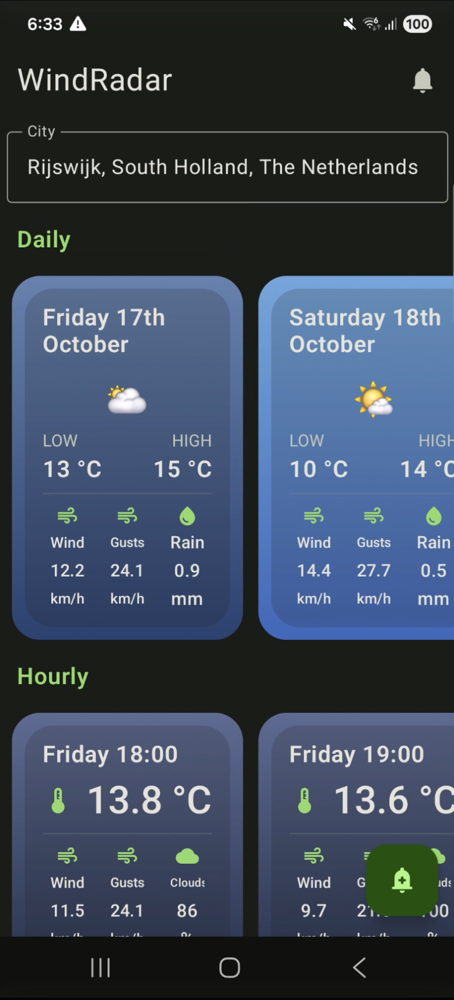
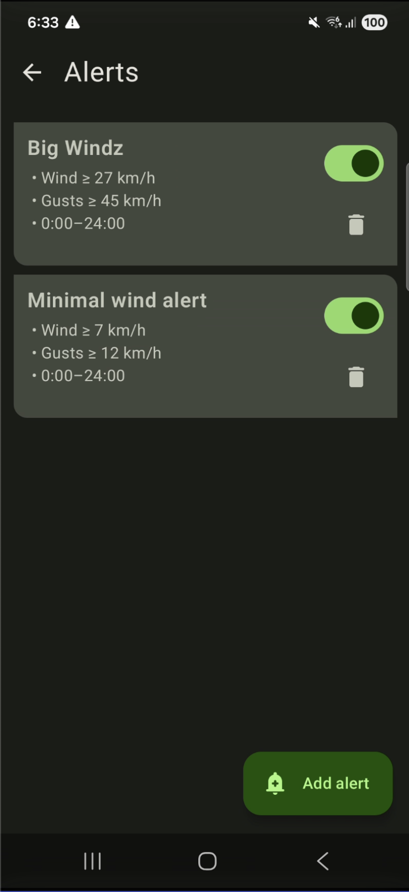
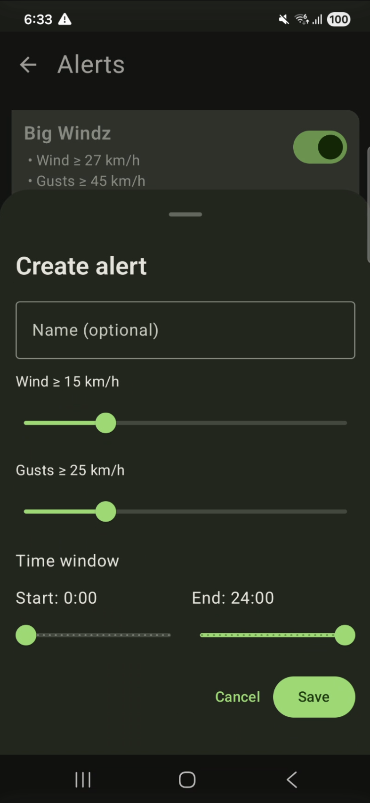

# 🌬️ WindRadar — Modern Android Weather & Wind Alert App

> A modern Android app built entirely with **Jetpack Compose**, **Material 3**, and **MVVM architecture** — demonstrating clean architecture, reactive data flow, dependency injection (Hilt, Room, DataStore), and WorkManager for hourly background tasks.

---

## ✨ Overview

**WindRadar** delivers real-time wind forecasts and customizable wind alerts using the latest **Android Jetpack** and **Material 3** guidelines.  
It’s designed as a showcase of **modern Android development best practices**, with a focus on scalability, separation of concerns, and reactivity.

---

## 📱 Screenshots

<p align="center">
  
  
  
</p>

## 🎯 Features

- 🌦️ **Live weather & wind forecasts** — powered by remote API data
- ⚠️ **Custom wind alerts** — define thresholds for wind speed and gusts
- 🕒 **Automatic background checks** — WorkManager evaluates alerts every hour
- 📍 **Persistent city selection** — stored safely with Proto DataStore
- 💾 **Offline alert storage** — Room database keeps your alerts local
- 🎨 **Modern Material 3 UI** — fully Compose-native, no XML layouts

---

## 🧠 Architecture

WindRadar is built with **MVVM** (Model–View–ViewModel) using reactive `Flow` streams.

```text
┌───────────────────────────────┐
│           UI Layer            │
│   (Jetpack Compose + M3)      │
└──────────────┬────────────────┘
               │ StateFlow
               ▼
┌───────────────────────────────┐
│         ViewModel Layer       │
│ Business logic, exposes state │
└──────────────┬────────────────┘
               │ Repository pattern
               ▼
┌───────────────────────────────┐
│          Data Layer           │
│  ├─ Remote: Retrofit + Hilt   │
│  ├─ Local: Room (SQLite)      │
│  └─ Preferences: DataStore    │
└───────────────────────────────┘
```

## 🧩 Dependency Injection (DI)

WindRadar demonstrates several **Dependency Injection** techniques:

| Purpose | Technology | Description                                                                             |
|----------|-------------|-----------------------------------------------------------------------------------------|
| **API & Network** | Hilt / Dagger | Injects Retrofit services and repositories for fetching weather and city data           |
| **Local Database** | Room | Stores and retrieves user-defined alerts  (`.db` file)                                  |
| **Preferences** | DataStore (Proto) | Persists the last selected city locally (`.pb` file)                                    |
| **Background Work** | WorkManager | Injected `AlertCheckWorker` runs hourly to analyze conditions and trigger notifications |

All dependencies are managed through **Hilt modules**, making the code clean, testable, and lifecycle-safe.

---

## 🧰 Tech Stack

| Category | Technology |
|-----------|-------------|
| **Language** | Kotlin |
| **UI** | Jetpack Compose + Material 3 |
| **Architecture** | MVVM + Clean Architecture |
| **Dependency Injection** | Hilt / Dagger |
| **Async / Reactive** | Coroutines + Flow |
| **Networking** | Retrofit + OkHttp |
| **Local Storage** | Room (SQLite) |
| **Preferences** | DataStore (Proto) |
| **Background Work** | WorkManager |
| **Logging** | Timber / Logcat |
| **Build Tools** | Gradle (KTS) |

## 🎨 User Interface

100% Jetpack Compose (no XML)

Built following Material 3 design system

Uses dynamic color schemes and adaptive typography

UI State managed with collectAsStateWithLifecycle() for lifecycle awareness

## 🧑‍💻 Author

Anaël
Android Developer passionate about modern, scalable, and reactive mobile architectures.
📍 Built with love, Kotlin, and wind.

GitHub: @Anael-S

LinkedIn: https://www.linkedin.com/in/anael-savoyant-651469117/